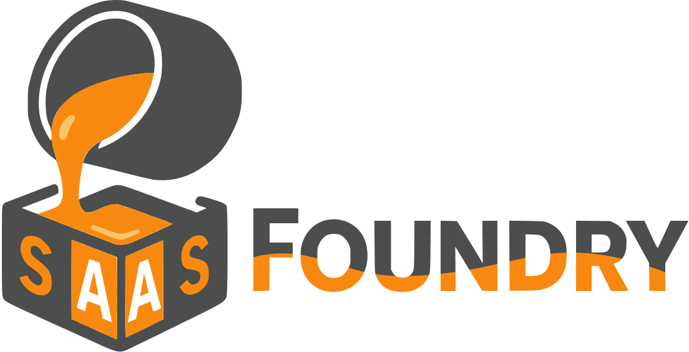

<div align="center">

[](https://github.com/AGachet/saasfoundry)
[](LICENSE)
[](https://reactjs.org/)
[](https://nestjs.com/)
[](https://www.typescriptlang.org/)
[](https://www.prisma.io/)
[](https://www.docker.com/)

</div>

<div align="center">
  <br /><br />
  
  <br /><br />
</div>

# 🌟 What is SaaSFoundry?

SaaSFoundry is a comprehensive, production-ready development platform for building modern SaaS applications. Far beyond a simple boilerplate, it's a complete ecosystem with CLI tools, automated
workflows, and integrated best practices. Born from the development of [BillMate Backend](https://github.com/AGachet/billmate-backend) and
[BillMate Frontend](https://github.com/AGachet/billmate-frontend), this open-source project provides a robust foundation for startups, freelancers, and developers looking to create scalable, secure,
and maintainable SaaS solutions in a TypeScript environment.

### 🎯 Key Features

- **Full-Stack Development Platform**

  - [NestJS Backend](scaffolds/blueprints/api/README.md) with modular design
  - [React Frontend](scaffolds/blueprints/web/README.md) with optimized performance
  - Docker containerization
  - Automated deployment workflows
  - CLI-based project configuration and scaffolding
  - End-to-end testing infrastructure with auto-mounted databases

- **Security First**

  - JWT authentication system
  - Role-based access control (RBAC)
  - Granular permissions management
  - Secure API endpoints

- **Developer Experience**

  - Pre-built React hooks for business logic
  - Adaptive preloading and cache management
  - Comprehensive Git hooks for code quality
  - Database migration scripts

- **Production Ready**
  - Version management system
  - Automated deployment pipeline
  - Health monitoring
  - Logging and error tracking

## 🔧 Prerequisites

To fully leverage SaaSFoundry's capabilities, the following tools are strongly recommended:

### 🐳 Docker

Docker is essential for running databases, tests, and containerized deployments:

```bash
# Install Docker on macOS (using Homebrew)
brew install --cask docker

# Install Docker on Ubuntu
curl -fsSL https://get.docker.com -o get-docker.sh
sudo sh get-docker.sh

# Verify installation
docker --version
```

### 📊 Node Version Manager (NVM)

NVM enables seamless switching between Node.js versions:

```bash
# Install NVM
curl -o- https://raw.githubusercontent.com/nvm-sh/nvm/v0.39.3/install.sh | bash

#  Auto-switch node version based on .nvmrc (add to your .zshrc or .bashrc)
autoload -U add-zsh-hook
load-nvmrc() {
  local node_version="$(nvm version)"
  local nvmrc_path="$(nvm_find_nvmrc)"

  if [ -n "$nvmrc_path" ]; then
    local nvmrc_node_version=$(nvm version "$(cat "${nvmrc_path}")")

    if [ "$nvmrc_node_version" = "N/A" ]; then
      nvm install
    elif [ "$nvmrc_node_version" != "$node_version" ]; then
      nvm use
    fi
  fi
}
add-zsh-hook chpwd load-nvmrc
load-nvmrcexport PATH="$HOME/.local/bin:$PATH"
```

### 🌈 Peacock (Optional)

Peacock is a Visual Studio Code extension that helps identify and distinguish projects by colorizing your workspace:

```bash
# For VS Code
# Install from VS Code marketplace: "johnpapa.vscode-peacock"

# For other compatible IDEs (like Cursor)
# Check the respective marketplace for Peacock or similar workspace colorizing extensions
```

This extension is particularly useful when working with multiple repositories simultaneously, offering visual differentiation between frontend and backend workspaces.

After installing these tools, you'll be ready to fully utilize all SaaSFoundry features, including containerized development environments and proper Node.js version management across projects.

## 🚀 Quick Start

1. **Create a new project using the integrated CLI**

```bash
# Install the CLI globally
npm install -g saasfoundry-cli@beta

# Create a new project
saasfoundry new
# or
sf new
```

2. **Choose your starting point**

- [Backend](scaffolds/blueprints/api/README.md/api/README.md)
- [Frontend](scaffolds/blueprints/web/README.md)

3. **Follow the detailed documentation** Each component has its own README with specific instructions and best practices.

## 🛠️ Project Structure

### 🏗️ Architecture Options

<div align="center">
<table>
<tr>
<th>
<h3>🔀 Multi-repository</h3>
<p><i>(Mono-repository comming soon)</i><p>
</th>
</tr>
<tr>
<td>

```
yourproject/
└── 📂 apps/
    ├── 📂 yourproject-api/        # NestJS Backend API
    │   ├── 🔵 src/
    │   │   ├── 🔵 common/         # fitlers, services...
    │   │   ├── 🔵 configs/        # Api docs, db, env, test...
    │   │   └── 🔵 modules/        # controllers, services, tests...
    │   │
    │   ├── 🔵 docs/               # Generated API documentation
    │   ├── 🔵 logs/               # API logs
    │   ├── 🔵 scripts/            # db, tag manager, test init
    │   ├── 🔵 tests/
    │   ├── 🔵 prisma/
    │   └── 🔵 docker-compose.yml  # Docker ready
    │
    ├── 📂 yourproject-db/          # PSQL database
    │   └── 🟢 docker-compose.db.yml
    │
    └── 📂 yourproject-web/         # React Frontend
        ├── 🟠 src/
        │   ├── components          # layout, nav, ui (shadcn, custom)
        │   ├── pages               # private / public
        │   ├── locales             # auth.yml, common.yml...
        │   ├── router              # guard, routes, lazy-pages...
        │   ├── hooks               # api / ui / ...
        │   └── utils
        │
        ├── 🟠 scripts/            # db, tag manager, test init
        ├── 🟠 public/
        └── 🟠 tests/

```

</td>
</tr>
</table>
</div>

> **💡 Tip**: Choose multi-repo for separate deployment cycles or mono-repo for tightly coupled projects with shared components.

## 💡 Why SaaSFoundry?

### For Startups

- **Time to Market**: Start with a production-grade development platform
- **Scalability**: Built for growth from day one
- **Cost-Effective**: Open-source ecosystem with no licensing fees

### For Freelancers

- **Professional Grade**: Enterprise-level architecture
- **Flexibility**: Adapt to any business requirement
- **Maintainability**: Well-structured, documented codebase

### For Developers

- **Best Practices**: Built-in industry standards and workflows
- **Developer Experience**: Streamlined development with integrated tools
- **Community**: Open-source collaboration and ecosystem

## 🤝 Contributing

We welcome contributions! Whether you're fixing bugs, improving documentation, or adding new features, your help is appreciated.

1. Fork the repository
2. Create your feature branch (`git checkout -b feature/amazing-feature`)
3. Commit your changes (`git commit -m 'feat: add amazing feature'`)
4. Push to the branch (`git push origin feature/amazing-feature`)
5. Open a Pull Request

### Commit Message Guidelines

We follow conventional commits for better versioning and changelog generation. While you can bypass checks with `--no-verify`, we encourage following these guidelines:

- `feat:` New features
- `fix:` Bug fixes
- `docs:` Documentation changes
- `style:` Code style changes
- `refactor:` Code refactoring
- `test:` Adding tests
- `chore:` Maintenance tasks

## 📚 Documentation

Detailed documentation is available at [saasfoundry.diamondforge.fr](https://saasfoundry.diamondforge.fr) (coming soon).

## 📄 License

This project is licensed under the MIT License - see the [LICENSE](LICENSE) file for details.

## 🙏 Acknowledgments

- Built as a complete SaaS acceleration platform
- Powered by [NestJS](https://nestjs.com) and [React](https://reactjs.org)
- Supported by the open-source community

---

<div align="center">
  Made with ❤️ by the SaaSFoundry Team
</div>
